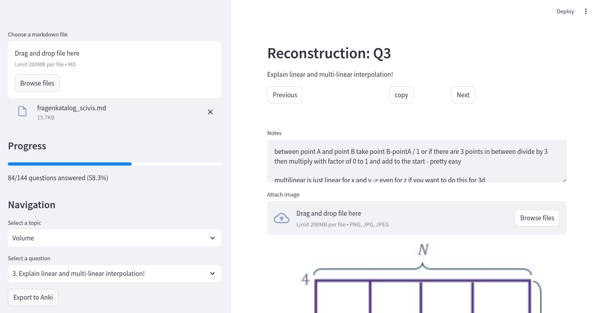

# Nachtigaller
Work on questions from a markdown questionnaire with the ability to add images, see progress and export all notes to anki.
All your progress is saved to a mysql database.

## Installation and Usage
```bash
git clone https://github.com/FlorianMehnert/Nachtigaller.git
cd Nachtigaller

# install all the required dependencies - consider using a virtual environment
pip install -r requirements.txt

# this should open http://localhost:8501/ if not go there in your browser
streamlit run st_markdown_questionnaire
```
## Markdown questionnaire
- markdown files of structure 
```markdown
# Title of your questionnaire

...

## Major topic

### Subtopic

1. Question1
2. ...
### Second topic
...
## Second major topic
...
```
## GUI


## Shortcuts
- <kbd>,</kbd> to go to the previous question
- <kbd>.</kbd> to go to the next question
 - <kbd>r</kbd> rerun the whole app
